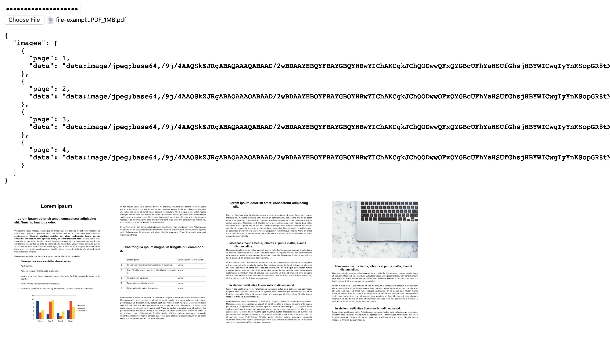

# PDF Parser

A tool to parse PDF files and extract text.

## Getting Started

1. Create a `.env.local` file:
```bash
API_KEY=your-secret-key-here
```

2. Run the development server:
```bash
npm run dev
```

## Testing

Visit the homepage to test PDF conversion using a simple upload interface:



This provides a quick way to verify that PDFs are being properly converted to images.

## API Usage

The API supports two ways to send PDFs:

### 1. JSON with Base64
```javascript
// JavaScript/TypeScript
const base64 = await new Promise((resolve, reject) => {
  const reader = new FileReader();
  reader.readAsArrayBuffer(file);
  reader.onload = () => {
    const buffer = Buffer.from(reader.result as ArrayBuffer);
    resolve(buffer.toString('base64'));
  };
  reader.onerror = reject;
});

const response = await fetch('/api/convert', {
  method: 'POST',
  headers: {
    'Content-Type': 'application/json',
    'x-api-key': 'your-api-key'
  },
  body: JSON.stringify({ pdf: base64 })
});
```

```bash
# curl
curl -X POST \
  -H "Content-Type: application/json" \
  -H "x-api-key: your-secret-key-here" \
  -d "{\"pdf\":\"$(base64 -i input.pdf)\"}" \
  http://localhost:3000/api/convert
```

### 2. Raw PDF
```javascript
// JavaScript/TypeScript
const formData = new FormData();
formData.append('pdf', file);

const response = await fetch('/api/convert', {
  method: 'POST',
  headers: {
    'Content-Type': 'application/pdf',
    'x-api-key': 'your-api-key'
  },
  body: file
});
```

```bash
# curl
curl -X POST \
  -H "Content-Type: application/pdf" \
  -H "x-api-key: your-secret-key-here" \
  --data-binary @input.pdf \
  http://localhost:3000/api/convert
```

Both methods return the same response format with converted images.
